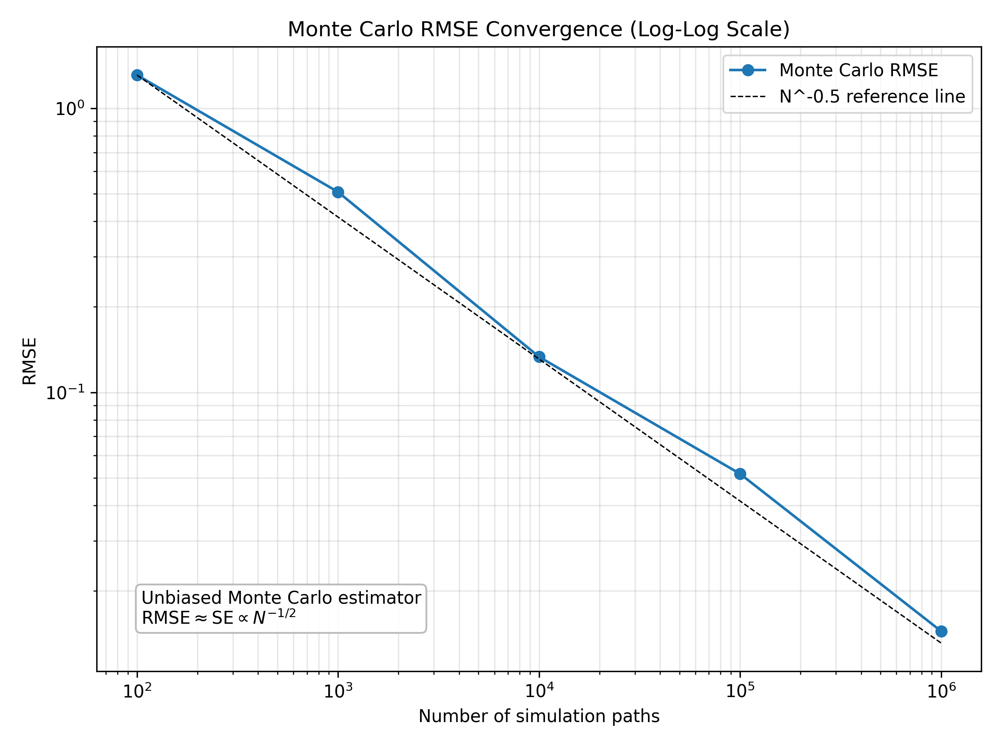
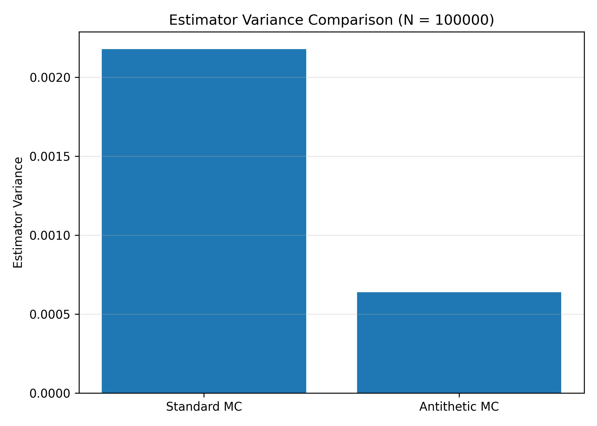

# Monte Carlo Option Pricing

A compact numerical-finance project for pricing European call options under the Black–Scholes model.

The project uses the analytical Black–Scholes price as a benchmark, reproduces it with Monte Carlo simulation, studies the statistical convergence of the estimator, and applies antithetic variates as a variance-reduction technique.

The main workflow is:

1. implement the Black–Scholes benchmark;
2. reproduce the option price using Monte Carlo simulation;
3. quantify numerical uncertainty using standard errors, confidence intervals, and RMSE;
4. verify the expected $N^{-1/2}$ Monte Carlo convergence rate;
5. compare standard and antithetic Monte Carlo under the same simulation budget.

## Project structure

```text
monte-carlo-option-pricing/
│
├── README.md
├── black_scholes.py
├── monte_carlo.py
├── experiments.py
├── notes.md
├── requirements.txt
├── .gitignore
│
└── figures/
    ├── convergence.png
    └── variance_comparison.png
```

### Files

* `black_scholes.py`
  European call payoff and closed-form Black–Scholes pricing benchmark.

<<<<<<< HEAD
* `monte_carlo.py`
  Standard Monte Carlo pricing and antithetic-variates pricing, including standard-error and confidence-interval estimates.

* `experiments.py`
  Validation checks, repeated convergence experiments, RMSE calculations, estimator-variance comparisons, and figure generation.

* `notes.md`
  Notes on the pricing model, Monte Carlo estimator, convergence behaviour, and antithetic variates.

* `figures/`
=======
- `monte_carlo.py`  
  Standard Monte Carlo pricing and antithetic-variates pricing, including standard-error and confidence-interval estimates.

- `experiments.py`  
  Validation checks, repeated convergence experiments, RMSE calculations, estimator-variance comparisons, and figure generation.

- `notes.md`  
  Notes on the pricing model, Monte Carlo estimator, convergence behaviour, and antithetic variates.

- `figures/`  
>>>>>>> da6f7c5 (1)
  Figures generated by the numerical experiments.

## Model

Under the Black–Scholes model, the stock price follows geometric Brownian motion under the risk-neutral measure:

<<<<<<< HEAD
\(dS_t = rS_t\,dt + \sigma S_t\,dW_t.\)

The terminal stock price can be simulated directly as

\(S_T = S_0\exp\left(\left(r-\frac{1}{2}\sigma^2\right)T+\sigma\sqrt{T}Z\right), \qquad Z\sim N(0,1).\)

For a European call option with strike price $K$, the payoff at maturity is

\((S_T-K)^+ = \max(S_T-K,0).\)

Under risk-neutral pricing, its time-0 value is

\(C_0 = e^{-rT}\mathbb{E}^{\mathbb{Q}}\left[(S_T-K)^+\right].\)
=======
$$dS_t = rS_t\,dt + \sigma S_t\,dW_t.$$

The terminal stock price can be simulated directly as

$$S_T = S_0\exp\left(\left(r-\frac{1}{2}\sigma^2\right)T+\sigma\sqrt{T}Z\right), \qquad Z\sim N(0,1).$$

For a European call option with strike price $K$, the payoff at maturity is

$$(S_T-K)^+ = \max(S_T-K,0).$$

Under risk-neutral pricing, its time-0 value is

$$C_0 = e^{-rT}\mathbb{E}^{\mathbb{Q}}\left[(S_T-K)^+\right].$$
>>>>>>> da6f7c5 (1)

The analytical Black–Scholes formula provides a known benchmark against which the Monte Carlo estimator can be tested.

## Monte Carlo estimator

Using $N$ independently simulated terminal stock prices, the Monte Carlo estimator is

<<<<<<< HEAD
\(\hat{C}_N = e^{-rT}\frac{1}{N}\sum_{i=1}^{N}\left(S_T^{(i)}-K\right)^+.\)
=======
$$\hat{C}_N = e^{-rT}\frac{1}{N}\sum_{i=1}^{N}\left(S_T^{(i)}-K\right)^+.$$
>>>>>>> da6f7c5 (1)

The implementation also estimates the standard error of $\hat{C}_N$ and reports an approximate 95% confidence interval.

For an unbiased Monte Carlo estimator with finite variance,

<<<<<<< HEAD
\(\mathrm{SE}(\hat{C}_N)\propto N^{-1/2}.\)
=======
$$\mathrm{SE}(\hat{C}_N)\propto N^{-1/2}.$$
>>>>>>> da6f7c5 (1)

Therefore, reducing the statistical error by a factor of 2 requires approximately 4 times as many simulation paths.

This $N^{-1/2}$ convergence rate is one of the main numerical properties tested in the project.

## Convergence experiment

Monte Carlo estimates are compared with the analytical Black–Scholes price using

```text
N = 10^2, 10^3, 10^4, 10^5, 10^6
```

simulation paths.

For each value of $N$, the pricing experiment is repeated independently several times. The experiment records:
<<<<<<< HEAD

* mean Monte Carlo price estimate;
* mean estimated standard error;
* empirical RMSE relative to the Black–Scholes benchmark;
* estimator variance across repeated runs;
* mean confidence-interval width.

The central convergence check is

\(\mathrm{RMSE}\approx\mathrm{SE}\propto N^{-1/2}.\)

=======

- mean Monte Carlo price estimate;
- mean estimated standard error;
- empirical RMSE relative to the Black–Scholes benchmark;
- estimator variance across repeated runs;
- mean confidence-interval width.

The central convergence check is

$$\mathrm{RMSE}\approx\mathrm{SE}\propto N^{-1/2}.$$

>>>>>>> da6f7c5 (1)
The log-log plot below compares the observed RMSE with the theoretical $N^{-1/2}$ rate.



## Antithetic variates

The project uses antithetic variates as a simple variance-reduction technique.

Instead of generating two unrelated Gaussian shocks, a shock $Z$ is paired with its antithetic counterpart $-Z$.

Since $Z\sim N(0,1)$ and $-Z\sim N(0,1)$, both simulated paths have the correct marginal distribution.

Let $Y(Z)$ denote the discounted option payoff generated from $Z$. An antithetic observation is constructed as

<<<<<<< HEAD
\(A = \frac{Y(Z)+Y(-Z)}{2}.\)

Its variance is

\(\mathrm{Var}(A)=\frac{1}{4}\left[\mathrm{Var}(Y(Z))+\mathrm{Var}(Y(-Z))+2\mathrm{Cov}(Y(Z),Y(-Z))\right].\)

For a monotone payoff such as a European call, the two antithetic payoffs tend to move in opposite directions. Their covariance can therefore be negative, reducing the variance of the pair average without changing its expected value.

## Fixed-budget comparison

To make the comparison fair, standard Monte Carlo and antithetic Monte Carlo are evaluated using the same total terminal-payoff budget.

For a total budget of $N$ simulated terminal payoffs:

* standard Monte Carlo uses $N$ independent Gaussian shocks;
* antithetic Monte Carlo uses $N/2$ independent shocks and their $N/2$ antithetic counterparts.

The two methods are compared using:

* mean price estimate;
* estimator variance;
* RMSE relative to the Black–Scholes benchmark.

A representative experiment with $N=100000$ gave:

| Metric             | Standard MC | Antithetic MC |
| ------------------ | ----------: | ------------: |
| Mean estimate      |   10.441513 |     10.447668 |
| Estimator variance |  0.00217885 |    0.00063875 |
| RMSE               |    0.046781 |      0.025019 |

The empirical variance reduction is measured by

\(1-\frac{\widehat{\mathrm{Var}}(\hat{C}_{\mathrm{anti}})}{\widehat{\mathrm{Var}}(\hat{C}_{\mathrm{standard}})}.\)
=======
$$A = \frac{Y(Z)+Y(-Z)}{2}.$$

Its variance is

$$\mathrm{Var}(A)=\frac{1}{4}\left[\mathrm{Var}(Y(Z))+\mathrm{Var}(Y(-Z))+2\mathrm{Cov}(Y(Z),Y(-Z))\right].$$

For a monotone payoff such as a European call, the two antithetic payoffs tend to move in opposite directions. Their covariance can therefore be negative, reducing the variance of the pair average without changing its expected value.

## Fixed-budget comparison

To make the comparison fair, standard Monte Carlo and antithetic Monte Carlo are evaluated using the same total terminal-payoff budget.

For a total budget of $N$ simulated terminal payoffs:

- standard Monte Carlo uses $N$ independent Gaussian shocks;
- antithetic Monte Carlo uses $N/2$ independent shocks and their $N/2$ antithetic counterparts.

The two methods are compared using:

- mean price estimate;
- estimator variance;
- RMSE relative to the Black–Scholes benchmark.

A representative experiment with $N=100000$ gave:

| Metric | Standard MC | Antithetic MC |
| --- | ---: | ---: |
| Mean estimate | 10.441513 | 10.447668 |
| Estimator variance | 0.00217885 | 0.00063875 |
| RMSE | 0.046781 | 0.025019 |

The empirical variance reduction is measured by

$$1-\frac{\widehat{\mathrm{Var}}(\hat{C}_{\mathrm{anti}})}{\widehat{\mathrm{Var}}(\hat{C}_{\mathrm{standard}})}.$$
>>>>>>> da6f7c5 (1)

For this experiment, the estimator variance was reduced by approximately **70.68%**.

The exact value changes slightly between executions because each experiment uses newly generated random samples.



## Validation

The default parameter set is

```text
S0    = 100
K     = 100
r     = 0.05
sigma = 0.20
T     = 1.0
```

For these parameters, the analytical Black–Scholes European call price is approximately

```text
10.4506
```

This provides a known reference value for validating the Monte Carlo implementation.

The experiment script also runs basic payoff and Black–Scholes sanity checks before performing the numerical experiments.

## How to run

Install the dependencies:

```bash
pip install -r requirements.txt
```

Run the experiments:

```bash
python experiments.py
```

The script prints the convergence results and the standard-versus-antithetic comparison, and generates the figures used in this README.

## What the project tests

The project focuses on five numerical questions:

<<<<<<< HEAD
* Can Monte Carlo reproduce the analytical Black–Scholes price?
* Does the empirical error decrease approximately as $N^{-1/2}$?
* Do the estimated standard errors agree with the observed variation across repeated simulations?
* Can antithetic sampling reduce estimator variance under the same simulation budget?
* How should numerical error be distinguished from model error?
=======
- Can Monte Carlo reproduce the analytical Black–Scholes price?
- Does the empirical error decrease approximately as $N^{-1/2}$?
- Do the estimated standard errors agree with the observed variation across repeated simulations?
- Can antithetic sampling reduce estimator variance under the same simulation budget?
- How should numerical error be distinguished from model error?
>>>>>>> da6f7c5 (1)

The Black–Scholes model is particularly useful for this purpose because its closed-form solution makes numerical error directly measurable.

This allows the Monte Carlo implementation to be validated before applying similar numerical methods to models or products for which no analytical pricing formula is available.

## Scope

V1 includes:

<<<<<<< HEAD
* European call pricing;
* Black–Scholes analytical benchmark;
* standard Monte Carlo simulation;
* standard errors and confidence intervals;
* repeated convergence experiments;
* RMSE analysis;
* antithetic variance reduction.

Possible extensions include:

* control variates;
* quasi-Monte Carlo;
* Monte Carlo Greeks;
* path-dependent options;
* implied volatility;
* market-data inputs;
* stochastic-volatility models.

V1 deliberately keeps the scope narrow. The objective is to demonstrate a complete numerical-pricing workflow and understand the statistical behaviour of the estimator before introducing more complex models or products.
=======
- European call pricing;
- Black–Scholes analytical benchmark;
- standard Monte Carlo simulation;
- standard errors and confidence intervals;
- repeated convergence experiments;
- RMSE analysis;
- antithetic variance reduction.

Possible extensions include:

- control variates;
- quasi-Monte Carlo;
- Monte Carlo Greeks;
- path-dependent options;
- implied volatility;
- market-data inputs;
- stochastic-volatility models.

V1 deliberately keeps the scope narrow. The objective is to demonstrate a complete numerical-pricing workflow and understand the statistical behaviour of the estimator before introducing more complex models or products.
>>>>>>> da6f7c5 (1)
